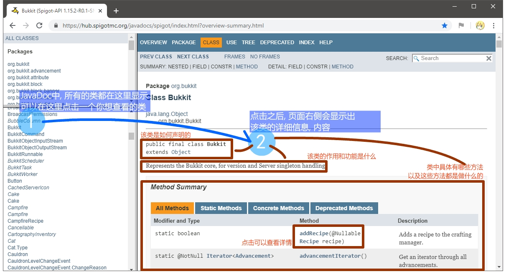

# 开始

也许你已经有了雄心壮志, 准备开发一个插件出来了! 但是等一下. 开发插件**也需要一定的基础知识**!  

# 一切的基础

有些东西, 在实际开发插件之前, 你必须要具备！

## 了解Minecraft

我们假定你已经对Minecraft有充分了解.  
例如, 我们认为诸如区块(Chunk)是什么这种问题是您早已明白的内容, 不会过分提及.

## Java基础

**插件开发对Java语言能力要求并不高**, 通常情况下插件开发只会用到最基础的Java语法知识, 且开发环境搭建极其简单.  
但是**不会Java的新手绝对不会开发插件, 绝对弄不明白如何开发插件.**  
本教程**不针对Java初学者**. 在本教程中, 将会尽可能避免较为复杂的Java语法知识.  


这些Java基础内容你可以在网上、书籍中和一些现有的文献中学习到.   

*本教程目标保证在Java8及以上环境下运行.*

## 编程的思维
编程的思维在实际编写一个项目当中尤为关键.  
有Java基础并不够, 只知道语法, 不知道怎么写, 与不会Java没有什么区别.  

在本教程中, 我们能做的只是告诉你“有什么”, 而无法解决你的插件“怎么写”的问题.  
例如, 我们告诉你“事件”, 但是如何利用“事件”真正的写出来一个“登录插件”、“商店插件”等各种插件出来, 这需要你自己思考！

希望你在实际开发中能够“脑洞大开”, 想出别人想不到的内容, 想出能打本文作者脸的好办法、新思路!

## 尝试
插件开发离不开调试.  
请你在提出问题之前、编写插件的过程中, 不要忘记不断调试, 这样你才能知道你的插件是否真的可以用, 别人说的不如自己试的, 自己想的不如实际干的.  

# 认识BukkitAPI的开发

## BukkitAPI的发展历史

在很早以前, Minecraft只有官方服务端.  

因为官方服务端开启的服务器无法安装插件, 无法拓展游戏功能. 因此, 一个团队创造出了Bukkit服务端. Bukkit服务端本质是修改了官方服务端的代码, 实现了插件系统.  

然而Bukkit服务端涉及了诸多法律问题. 最后Bukkit服务端停止更新.  

后续SpigotMC社区的大神MD_5延续并接手BukkitAPI的维护工作, 他在BukkitAPI的基础上做出Spigot服务端. 此后有许多衍生服务端都在Spigot的基础之上被研发出来.  

**由此而看, BukkitAPI并不是只有Bukkit服务端才能用, 其衍生出的Spigot等诸多衍生服务端都能用.**  

## 怎么进行插件开发

在实际开发当中, 我们可以认为Bukkit、Spigot以及其衍生服务端(Paper等服务端)都是一回事.  

开发BukkitAPI插件只需要准备一个用来开服的Jar文件. 推荐准备Spigot的服务端Jar文件.  
然后你需要将该Jar文件当做“Libraries”文件导入至工程中即可开始开发.

对于BukkitAPI相关的问题, 通常百度上没有什么有价值的内容, 不妨添加一些开发者QQ群询问, 一些热心的开发者会回答你!  
但是你要区分清楚 Java基础 和 Bukkit开发! 但是如果你有百思不得其解的问题, 不妨还是问一下, 问问题是成长的最快途径.  

## 对象化的Minecraft

Java是一门面向对象的语言.  
BukkitAPI下的MC世界, 正是一个由许多对象构成的世界.  

例如Minecraft中的每一个玩家都是一个`Player`类型的对象, 每一个方块都可以有其对应的`Block`对象, 每个生物都是一个`Entity`对象......  

在实际开发中, 你需要有“会猜的能力”. 例如, 如果你想操作一个玩家, 那你应该能大致猜出来, 我们要做的应该是获得这个玩家的`Player`对象, 对这个`Player`对象进行操作......

## 了解JavaDoc

我们在开发插件时, 必须要用到JavaDoc. 我们可以通过JavaDoc查询到BukkitAPI都有哪些API, 以及使用方法.  

最新版本JavaDoc网址: https://hub.spigotmc.org/javadocs/spigot/index.html?overview-summary.html  
旧版本JavaDoc网址(1.7.10): http://jd.bukkit.org/  

国内有一群热爱开发的人做出了中文JavaDoc, 开发时可以用以参考.  
最新版本中文JavaDoc网址: https://bukkit.windit.net/javadoc/  
他们的GitHub地址: https://github.com/BukkitAPI-Translation-Group/Chinese_BukkitAPI  

**JavaDoc分为左右两个大部分, 左侧上方部分为所有的包, 左侧下方部分为所有的类, 右侧即为你选择的内容的详细信息.** 使用时操作基本方法如下:  



## 寻找我们想要的信息

> 例: 现在我们有了一个`Player`对象, 如何向这个`Player`对象对应玩家发送一个消息`Hello guy!`?
> ```java
> Player p = 魔法; //这是我们现在获得的一个Player对象
> ```

### 利用JavaDoc找到想要的信息

对于我们不知道的东西, 我们应该查看JavaDoc. 这里我们想查询`Player`类里怎样给玩家发信息, 按照上面的方法打开Player类的详细信息. 利用浏览器的搜索功能`Ctrl+F`, 你可以试着搜一些与“信息”有关的英文词汇, 比如`message`等.  
我们可以发现, JavaDoc中说`Player`类从`CommandSender`类里继承来了`sendMessage`方法, 很可能符合我们的需求.  


点击`sendMessage`可以跳转到`CommandSender`类中对`sendMessage`方法描述的地方, 我们可以查看关于`sendMessage`方法有关的内容.


通过描述, 我们可以得知, `sendMessage`方法的作用是`Sends this sender a message`. 这样一想, `Player`继承了`CommandSender`, 我们想给玩家发信息就是给玩家这个`Sender`发信息, 这个方法就是我们要找的东西了！  
那么我们就应该这样调用这个方法:  

```java
p.sendMessage("Hello guys!");
```

### 看看别人是怎么做的

很多插件都有向玩家发信息的功能. 如果一个东西自己实在找不到了, 那就看看别人是怎么弄的.    


先随便找一个插件, 看清楚是`Spigot`插件, 并且插件介绍帖里提到它会定时给玩家发一个消息叫`[系统] 您已进入挂机模式, 再次移动可取消挂机状态`. 这个发送功能恰是我们需要的. 我们可以下载下来这个插件, 用反编译软件(例如:JD-GUI)打开它.  

可能因为插件太简单, 作者并没有给这个插件混淆, 我们用JD-GUI可以正常反编译出源码, 顺着这个提示语一翻, 可以轻松找到这个发送信息功能的实现方式, 它用的正是`p.sendMessage`:  


